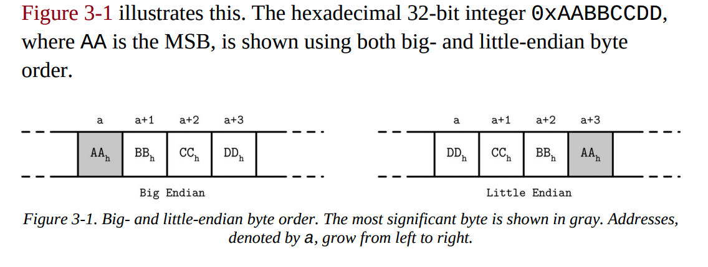

# Database Internal

***This file mark down is summary from Database Internals book***

## 1. File Formats:
### Primitive Types:
Keys and values have a typem such as interger, date, string anf can be represented in their binary forms.
Most numeric data types are represented as fixed-size values. 
It is very important to use the same byte-order for both encoding and decoding. This byte-order called endianess.

*Big-endian* 

The order starts from the most singnificant byte (MSB), for example:

### Strings and Variable-Size Data
### Bit-Packed Data: Booleans, Enums, and Flags

#### Boolen
#### Enums
#### Flags

## 2. General Principles
File is split into same-sized pages which are represented by a single block or multiple contiguous blocks. Most in-place update storage structures use pages of the same size.

File usually starts with a fixed-size header and many end with a fixed-size trailer.

Many data stores have a fixed schema, specifying the number, order and type of fields the table can hold. Having a fixed schema helps to reduce amount of data stored on disk: 

### Page Structure
Database systems store data records in data and index files.
These files are partioned into fixed-size called pages, which range from 4 to 16 Kb.

Figure 3.4 describle a simple page for fixed-size data records, each page is just a concatenation of triplets, keys: k, associated value v and pointers to child page: p

